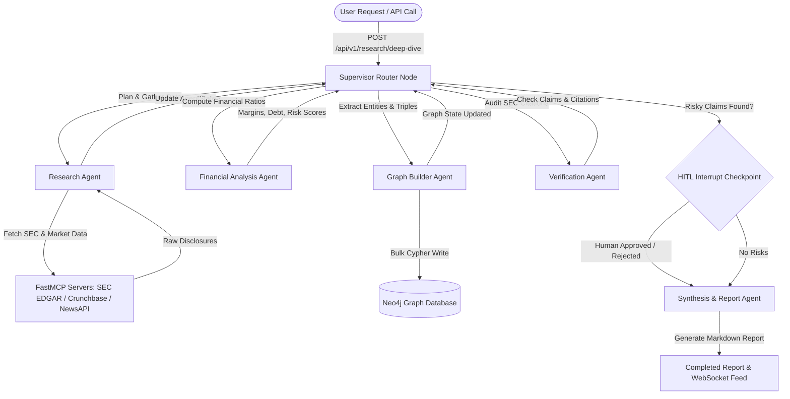
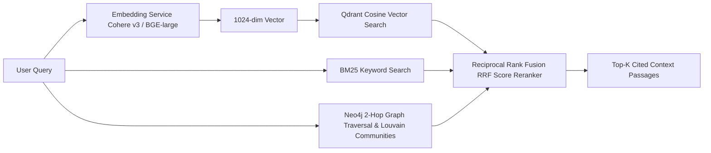

# Aether: Autonomous Multi-Agent Financial Intelligence Platform

[](https://github.com/rhythem27/aether/actions/workflows/ci.yml)
[](https://www.python.org/downloads/)
[](https://fastapi.tiangolo.com/)
[](https://github.com/langchain-ai/langgraph)
[](https://qdrant.tech/)
[](https://neo4j.com/)
[](https://www.docker.com/)
[](https://github.com/astral-sh/ruff)
[](LICENSE)

**Aether** is an enterprise-grade autonomous multi-agent financial intelligence platform designed for automated SEC disclosure analysis, corporate due diligence, risk modeling, and knowledge graph construction. Powered by **LangGraph**, **Model Context Protocol (MCP)**, **Qdrant Vector DB**, and **Neo4j GraphRAG**, Aether orchestrates specialized agent swarms to synthesize institutional financial reports with human-in-the-loop safety verification.

---

## 📑 Table of Contents

- [Core Value Proposition & Features](#-core-value-proposition--features)
- [System Architecture & Multi-Agent Swarm](#-system-architecture--multi-agent-swarm)
- [GraphRAG Dual-Path Retrieval Engine](#-graphrag-dual-path-retrieval-engine)
- [Getting Started & Local Execution](#-getting-started--local-execution)
- [Environment Configuration Reference](#-environment-configuration-reference)
- [API Routes & WebSockets Map](#-api-routes--websockets-map)
- [Architecture Decision Records (ADRs)](#-architecture-decision-records-adrs)
- [Community Governance & Contributing](#-community-governance--contributing)

---

## 🎯 Core Value Proposition & Features

* 🤖 **LangGraph Stateful Supervisor Orchestration:** Features 6 specialized agents (`supervisor`, `research`, `analysis`, `verify`, `graph_builder`, `report`) governed by a state machine with PostgreSQL checkpoint persistence.
* 🔌 **Model Context Protocol (MCP) Native:** Integrates custom FastMCP servers (`sec-edgar`, `crunchbase`, `newsapi`, `neo4j`), isolating data ingestion from core LLM logic via JSON-RPC protocol bindings.
* 🕸️ **GraphRAG Dual-Path Retrieval Engine:** Combines Qdrant dense vector similarity (Cosine, 1024-dim) with Neo4j 2-hop graph traversal and GDS Louvain community detection, fused via Reciprocal Rank Fusion (RRF $k=60.0$).
* 🛡️ **Human-in-the-Loop (HITL) Safety Checkpoints:** Employs `interrupt()` gates before high-risk valuation claims or financial risks are finalized into client reports.
* 📊 **Observability & Evaluation Pipeline:** Instrumented with **Langfuse** `@observe()` tracing, Prometheus metrics, and automated Pytest evaluation suites for hallucination rate and citation accuracy benchmarking.

---

## 🧠 System Architecture & Multi-Agent Swarm

The following diagram illustrates how the LangGraph Supervisor orchestrates state transitions across agents:



---

## 🔬 GraphRAG Dual-Path Retrieval Engine

Unlike naive RAG, Aether uses dual-path hybrid retrieval to preserve multi-hop entity relationships and financial disclosures:



---

## 🚀 Getting Started & Local Execution

### Prerequisites
* **Python 3.11+**
* **Poetry 1.8+**
* **Docker & Docker Compose**

### Step-by-Step Installation

```bash
# 1. Clone Repository
git clone https://github.com/rhythem27/aether.git
cd aether

# 2. Install Dependencies via Poetry
poetry install

# 3. Setup Environment File
cp .env.example .env

# 4. Spin up Infrastructure (Qdrant, Neo4j, Redis, Postgres, Langfuse)
docker compose up -d

# 5. Initialize Database Schema
poetry run python -m backend.db.init_db

# 6. Start FastAPI API Server
poetry run uvicorn backend.api.main:app --reload --host 0.0.0.0 --port 8000

# 7. Start Celery Background Worker
poetry run celery -A backend.workers.research_tasks worker --loglevel=info --concurrency=4

# 8. Run Pytest Test Suite
poetry run pytest --cov=backend --cov-report=html
```

---

## ⚙️ Environment Configuration Reference

All settings are managed via `pydantic-settings` in [config.py](file:///c:/git-hub/Aether/backend/core/config.py):

| Variable Name | Default Value | Description |
| :--- | :--- | :--- |
| `ENVIRONMENT` | `development` | Runtime environment mode (`development`, `production`, `test`) |
| `LOG_LEVEL` | `INFO` | Logging output level (`DEBUG`, `INFO`, `WARNING`, `ERROR`) |
| `QDRANT_URL` | `http://localhost:6333` | Vector Database host URL |
| `NEO4J_URI` | `bolt://localhost:7687` | Neo4j Graph Database Bolt connection URI |
| `NEO4J_USER` | `neo4j` | Neo4j authentication username |
| `NEO4J_PASSWORD` | `password` | Neo4j authentication password |
| `POSTGRES_HOST` | `localhost` | PostgreSQL host address |
| `POSTGRES_PORT` | `5432` | PostgreSQL connection port |
| `REDIS_URL` | `redis://localhost:6379/0` | Redis broker URL for Celery and caching |
| `OPENAI_API_KEY` | `sk-...` | OpenAI API key for GPT-4o LLM nodes |
| `COHERE_API_KEY` | `ch-...` | Cohere API key for `embed-english-v3.0` vectors |
| `LANGFUSE_HOST` | `http://localhost:3000` | Langfuse tracing dashboard URL |

---

## 🌐 API Routes & WebSockets Map

| Method | Endpoint Path | Description |
| :--- | :--- | :--- |
| `GET` | `/health` | Application & database health probes (`qdrant`, `neo4j`, `postgres`, `redis`) |
| `GET` | `/ready` | K8s readiness probe returning `200 OK` |
| `POST` | `/api/v1/documents/upload` | Multi-format doc parsing (`unstructured`), chunking & vector indexing |
| `POST` | `/api/v1/documents/query` | Hybrid dense+sparse vector search with payload filtering |
| `POST` | `/api/v1/research/deep-dive` | Enqueue multi-agent financial due diligence research workflow |
| `GET` | `/api/v1/research/jobs/{job_id}` | Poll research job execution status and activities |
| `WS` | `/api/v1/ws/{job_id}` | Live WebSocket stream of agent activity logs & progress |

---

## 📐 Architecture Decision Records (ADRs)

Our technical decisions and trade-offs are documented in `docs/adr/`:

* 📄 **[ADR 0001: Model Context Protocol (MCP) Adoption](file:///c:/git-hub/Aether/docs/adr/0001-mcp-adoption.md)**
* 📄 **[ADR 0002: LangGraph Supervisor Pattern](file:///c:/git-hub/Aether/docs/adr/0002-langgraph-supervisor.md)**
* 📄 **[ADR 0003: GraphRAG Hybrid Retrieval](file:///c:/git-hub/Aether/docs/adr/0003-graphrag-hybrid-retrieval.md)**

---

## 🤝 Community Governance & Contributing

We welcome contributions from the open-source community! Please review our governance guidelines before submitting pull requests:

* 📜 **[Contributing Guidelines](file:///c:/git-hub/Aether/CONTRIBUTING.md)**
* 🛡️ **[Code of Conduct](file:///c:/git-hub/Aether/CODE_OF_CONDUCT.md)**
* 🔒 **[Security Policy](file:///c:/git-hub/Aether/SECURITY.md)**
* 📄 **[Pull Request Template](file:///c:/git-hub/Aether/.github/PULL_REQUEST_TEMPLATE.md)**

---

## 📄 License

Distributed under the **MIT License**. See `LICENSE` for more information.