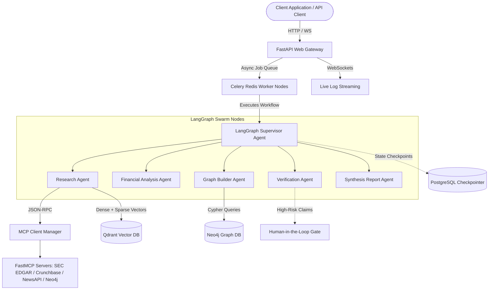

# Aether Platform Architecture Blueprint

This document provides a comprehensive technical overview of the **Aether** platform architecture, multi-agent orchestration, GraphRAG retrieval engine, and Model Context Protocol (MCP) data tool integration.

---

## 🏛️ System Architecture Overview

Aether is designed as a distributed, decoupled multi-agent platform capable of processing unstructured financial filings (SEC 10-K/10-Q, earnings transcripts), synthesizing financial due diligence reports, and building corporate knowledge graphs.



---

## 🤖 1. Multi-Agent Swarm & State Routing

Aether uses **LangGraph** to manage stateful multi-agent workflows. Central to this architecture is the `AgentState` typed schema, maintained across graph node transitions:

```python
class AgentState(TypedDict):
    messages: List[BaseMessage]
    company_ticker: str
    company_name: str
    fiscal_year: int
    research_data: Dict[str, Any]
    analysis_results: Dict[str, Any]
    verified_claims: List[Dict[str, Any]]
    graph_operations: List[Dict[str, Any]]
    report_sections: Dict[str, Any]
    human_approval: bool
    errors: List[str]
    token_usage: Dict[str, int]
```

### Agent Roles & Responsibilities

1. **Supervisor Router (`supervisor`)**: Decides the next specialized node based on state completeness or finishes workflow execution.
2. **Research Agent (`research_agent`)**: Gathers SEC filings, market disclosures, and news using MCP data tools.
3. **Financial Analysis Agent (`analysis_agent`)**: Calculates profit margins, debt ratios, and risk scores.
4. **Graph Builder Agent (`graph_builder_agent`)**: Extracts corporate entities and relationships, bulk writing to Neo4j.
5. **Verification Agent (`verify_agent`)**: Audits claims against primary sources and triggers `interrupt()` HITL checkpoints for unverified financial risks.
6. **Synthesis & Report Agent (`report_agent`)**: Formats the final Markdown due diligence report with source citations.

---

## 🔬 2. GraphRAG Hybrid Retrieval (Qdrant + Neo4j)

Aether solves naive RAG limitations using **Dual-Path Hybrid Retrieval**:

1. **Dense Vector Search:** Qdrant `financial_intelligence` collection using Cohere `embed-english-v3.0` (1024-dim, Cosine distance).
2. **Sparse Keyword Matching:** BM25 keyword overlap score.
3. **Graph Traversal & Community Detection:** Neo4j 2-hop graph neighborhood search and Louvain community summaries.
4. **Reciprocal Rank Fusion (RRF):** Merges vector similarity and graph connection scores using $RRF = \sum \frac{1}{k + r_i}$ ($k=60.0$).

---

## 🔌 3. Model Context Protocol (MCP) Ecosystem

Data access is decoupled using FastMCP servers exposing tools via standardized JSON-RPC schemas:
* `sec-edgar`: Fetches SEC 10-K, 10-Q, and 8-K filings.
* `crunchbase`: Retrieves funding history and lead investor details.
* `newsapi`: Fetches real-time market disclosures and press releases.
* `neo4j`: Exposes Cypher graph traversal tools.

---

## 📊 4. Observability & Evaluation

* **Langfuse Tracing:** `@observe()` decorators track per-agent latency, prompts, and token expenditure.
* **Prometheus & Grafana:** Exposes standard `/metrics` endpoint for real-time monitoring.
