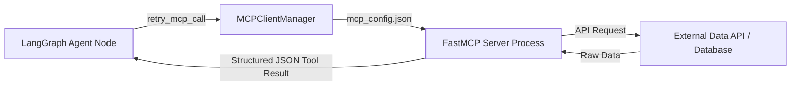

# Model Context Protocol (MCP) Server Integration Guide

**Aether** adopts the **Model Context Protocol (MCP)** to standardise how LLM agents interact with external data providers (SEC EDGAR filings, Crunchbase company funding, real-time news, and Neo4j graph stores).

---

## 🔌 1. FastMCP Architecture Overview

Rather than embedding API calls directly into agent node logic, Aether implements standalone FastMCP servers (`backend/mcp/servers/`). Each server exposes standardized tools via JSON-RPC protocol schemas over stdio or SSE transports.



---

## 🛠️ 2. Available FastMCP Servers

### 📄 SEC EDGAR MCP Server (`sec-edgar`)
* **File:** `backend/mcp/servers/sec_edgar.py`
* **Tools:**
  * `get_sec_filings(ticker: str, form_type: str = "10-K")`: Fetches raw text and financial tables from SEC filings.
  * `get_company_facts(ticker: str)`: Retrieves CIK number, SEC registration info, and financial history.

### 💼 Crunchbase MCP Server (`crunchbase`)
* **File:** `backend/mcp/servers/crunchbase.py`
* **Tools:**
  * `get_funding_rounds(company_name: str)`: Fetches total capital raised, lead investors, and round valuations.
  * `get_investor_portfolio(investor_name: str)`: Fetches active investments and exits.

### 📰 NewsAPI MCP Server (`newsapi`)
* **File:** `backend/mcp/servers/newsapi.py`
* **Tools:**
  * `get_market_news(query: str, days: int = 30)`: Fetches market news disclosures and analyst reports.

### 🕸️ Neo4j Graph MCP Server (`neo4j`)
* **File:** `backend/mcp/servers/neo4j.py`
* **Tools:**
  * `execute_cypher(query: str)`: Executes read-only Cypher queries against Neo4j graph database.
  * `traverse_graph(entity_name: str, depth: int = 2)`: Fetches multi-hop entity neighborhoods.

---

## ⚙️ 3. Client Configuration (`mcp_config.json`)

The `MCPClientManager` dynamically registers tools defined in `mcp_config.json`:

```json
{
  "mcpServers": {
    "sec-edgar": {
      "command": "python",
      "args": ["-m", "backend.mcp.servers.sec_edgar"],
      "env": {
        "EDGAR_API_KEY": "${EDGAR_API_KEY}"
      }
    },
    "crunchbase": {
      "command": "python",
      "args": ["-m", "backend.mcp.servers.crunchbase"],
      "env": {
        "CRUNCHBASE_KEY": "${CRUNCHBASE_KEY}"
      }
    }
  }
}
```

---

## 🚀 4. How to Author a Custom FastMCP Server

To add a new data provider (e.g. Bloomberg, FactSet):

1. Create a new module `backend/mcp/servers/my_provider.py`.
2. Define FastMCP tools using `@mcp.tool()` decorators:

```python
from fastmcp import FastMCP

mcp = FastMCP("my-provider")

@mcp.tool()
async def get_custom_data(ticker: str) -> dict:
    """Fetch custom financial metrics for a company."""
    return {"ticker": ticker, "metric": 100.0}

if __name__ == "__main__":
    mcp.run()
```

3. Register your server in `mcp_config.json`.
